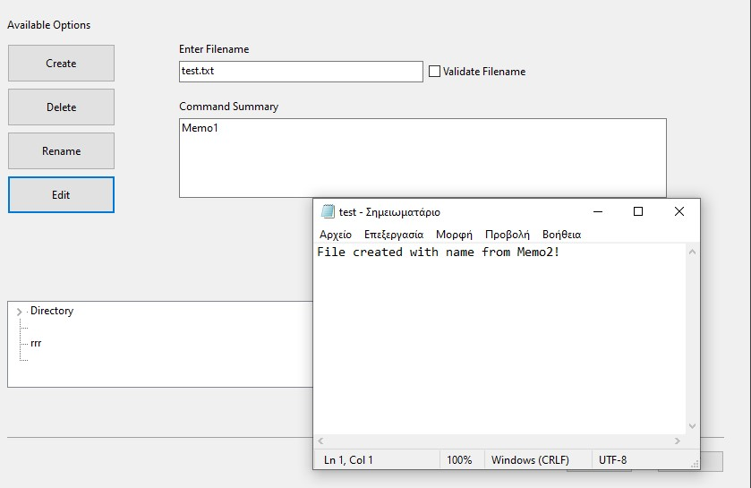

# FileForge 🔨

    
Welcome to **FileForge**! This project is a powerful file management tool designed to simplify handling files and directories. With FileForge, you can create, delete, rename, and open files with ease, all within an intuitive interface.

    
 <!-- Replace with your logo URL -->

## Features 🌟

- **Create Files**: Easily create new files with custom names.
- **Delete Files**: Remove files with a single click.
- **Rename Files**: Effortlessly rename files.
- **Open Files**: Open files in the default text editor.
- **Directory Tree View**: Visualize your file system with an expandable tree view.
- **Cross-Platform**: Works on Windows platforms.

## Getting Started 🚀

To get started with FileForge, follow these steps:

### Prerequisites 📦

- [C++ Builder](https://www.embarcadero.com/products/delphi) (version X or later)
- Ensure your development environment is set up correctly.

Installation 💻

    Clone the Repository:

    git clone https://github.com/PanagiotisKots/FileForge.git
    

Open the Project:

    Open C++ Builder and navigate to the cloned repository.
    Open the project file FileForge.bpr (or .cbproj).

Build the Project:

    Compile and build the project using C++ Builder.

Run the Application:

    Execute the built application from your IDE or directly from the output folder.

 <!-- Replace with your logo URL -->

## Usage 📘

### File Operations

| **Action**         | **Description**                                                              |
|--------------------|------------------------------------------------------------------------------|
| **Create a File**  | Enter the file name in the Memo2 field and click "Create".                   |
| **Delete a File**  | Enter the file name in the Memo2 field and click "Delete".                   |
| **Rename a File**  | Enter the old file name in Memo2, and follow the prompts to enter the new name. |
| **Open a File**    | Enter the file name in Memo2 and click "Open".                               |

### Directory Tree View

Explore directories and files using the tree view on the left.

 <!-- Replace with your logo URL -->
## Contributing 🤝

We welcome contributions to **FileForge**! If you’d like to contribute, please follow these steps:

1. **Fork the repository**.
2. **Create a new branch**:

   git checkout -b feature/your-feature

    Commit your changes:

git commit -am 'Add new feature'

Push to the branch:

    git push origin feature/your-feature

    Create a new Pull Request.

License 📜

This project is licensed under the MIT License - see the LICENSE file for details.
Contact 📧

For any inquiries, please reach out to pkotsorgios654@gmail.com.

### Notes:
- Update the email address in `[pkotsorgios654@gmail.com.com](mailto:pkotsorgios654@gmail.com)` with the actual contact email.
- Ensure the `LICENSE` file link is correct if you have it in the repository or adjust the path as needed.

## Contact the Creator 🤝

Here’s how you can get in touch with the creator of **FileForge**. Whether you have questions, suggestions, or just want to say hello, feel free to reach out!
### Creator Information 🧑‍💻

| **Attribute**      | **Details**                                                                                          |
|--------------------|------------------------------------------------------------------------------------------------------|
| **Name**           | Panagiotis Kotsorgios|
| **Role**           | Lead Developer                                                                                      |
| **LinkedIn**       |   |
| **GitHub**         |  )           |

### Contact Information 📧

| **Method**         | **Details**                                                                                          |
|--------------------|------------------------------------------------------------------------------------------------------|
| **Email**          |  [johndoe@example.com](mailto:johndoe@example.com) |

## Technologies and Tools Used 🛠️

| **Technologies & Tools**                                                                                       |
|-----------------------------------------------------------------------------------------------------------------|
|           |

